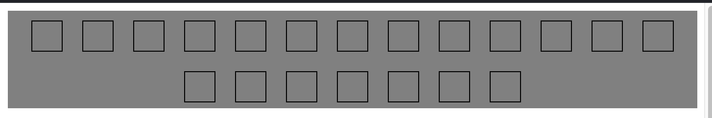
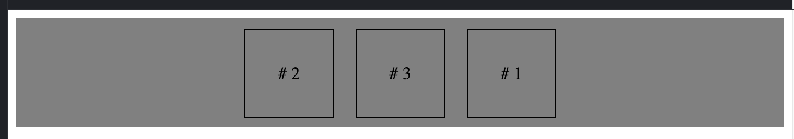

## A guide contains everything you need to know about CSS flexbox


>The Flexible Box Module, usually referred to as flexbox, was designed as a one-dimensional layout model, and as a method that could offer space distribution between items in an interface and powerful alignment capabilities. This article gives an outline of the main features of flexbox, which we will be exploring in more detail in the rest of these guides.

>When we describe flexbox as being one dimensional we are describing the fact that flexbox deals with layout in one dimension at a time — either as a row or as a column. This can be contrasted with the two-dimensional model of CSS Grid Layout, which controls columns and rows together.
>
<cite>[MDN Web Docs](https://developer.mozilla.org/en-US/docs/Web/CSS/CSS_Flexible_Box_Layout/Basic_Concepts_of_Flexbox) <cite>

During the good old days of the Web float and table were heavily used.


**Flex container** - A parent element that establishes a flex container by defining CSS ```display: flex;``` attribute.

**Flex items** - Elements that are children of a flex container.

Let's look at very basic example:

```html 
<div class='parent'>
    <div class='child'></div>
    <div class='child'></div>
    <div class='child'></div>
    <div class='child'></div>
    <div class='child'></div>
</div>
```
```css
.parent {
  display: flex;
  flex-direction: column;
}

.child {
  height: 30px;
  margin: 10px 0;
  width: 100%;
  border: 1px solid black;
}
```
In the example above div element with the name parent defines the flex container and contains 5 children div elements.

Another important concept of CSS flex model is axes which defines the alignment of children in the flex container whether vertical or horizontal. When working with flexbox you need to think in terms of two axes — the main axis and the cross axis. The main axis is defined by the flex-direction property, and the cross axis runs perpendicular to it. Everything we do with flexbox refers back to these axes, so it is worth understanding how they work from the outset. Probably you are gonna need only to define main axis not the cross one.

The main axis is defined by ```flex-direction```, which has four possible values:

- row
- row-reverse
- column
- column-reverse


Choose ```column``` or ```column-reverse``` and your main axis will run from the top of the page to the bottom — in the block direction.


In order to align items in the flex container we need to define the alignment in multiple ways. Let's look at some possible options with hands-on examples

1. 
```css
    justify-content: ;
```
The justify-content property is used to align the items on the main axis, the direction in which flex-direction has set the flow. The initial value is flex-start which will line the items up at the start edge of the container, but you could also set the value to flex-end to line them up at the end, or center to line them up in the centre.


Taking into account the example above, the default alignment of the flex items is left as can be seen from the picture below:


Possible values for justify-content are:

- flex-start
- flex-end
- center
- space-around
- space-between
- space-evenly

Let's try to align the items in the centre as it is the biggest trouble of front-end developers :)


Easy, right?

But, so far my favourite is the space-between option which spreads the items equally between the start and end edges of the container. Otherwise we would have to use margin or some other "dirty" way to achieve the same result.


2.
```css
    align-items: ;
```
The align-items property is used to align flex items on the cross axis, the direction in which flex-direction has set the flow. The initial value is stretch which will stretch the items to take up the full height of the container, but you could also set the value to flex-start to align the items at the start edge of the container, or flex-end to align them at the end, or center to align them in the centre.

Possible values for align-items are:

- stretch
- flex-start
- flex-end
- center
- baseline

If we simply increase the height of parent element in the previous example, we will see that the items will be aligned at the top of the container. This is where ```align-items``` comes in.


Let's fix the problem and try to align the items at the center of the container via the code below:

```css
.parent {
  display: flex;
  height: 100px;
  flex-direction: row;
  background-color: gray; 
  justify-content: center;
  align-items:center;
}
```
Perfect!


Lastly, let's try to align one specific child of flex container by using the ```align-self``` property. Before this, we need to add selector for specific child.

```css
.child:nth-of-type(3) {
  align-self: center;
}
```
The code above uses CSS so-called pseudo-class to select the third child of flex container and applies ```align-self``` for vertical axis. And the result is:


For the example parent container if we add many child elements where if overflows the container, another useful property is ```flex-wrap``` comes in.

Let's first see the problem and then solution:

Here I have added many more children to the parent container.

```html

<div class='parent'>
    <div class='child'></div>
    <div class='child'></div>
    <div class='child'></div>
    <div class='child'></div>
    <div class='child'></div>
    <div class='child'></div>
    <div class='child'></div>
    <div class='child'></div>
    <div class='child'></div>
    <div class='child'></div>
    <div class='child'></div>
    <div class='child'></div>
    <div class='child'></div>
    <div class='child'></div>
    <div class='child'></div>
    <div class='child'></div>
    <div class='child'></div>
    <div class='child'></div>
    <div class='child'></div>
    <div class='child'></div>
</div>
```


We can see that the children shrink to fit the container and the result is ugly. 

After adding 

```css
.parent {
  ...
  flex-wrap: wrap;
}
```
we get quite nice result!



Another nice feature of CSS flex is explicit ordering the child elements. For the example below

```html
<div class='parent'>
    <div class='child'># 1</div>
    <div class='child'># 2</div>
    <div class='child'># 3</div>
</div>
``` 
the default ordering will be #1, #2, #3 unsurprisingly.


In order to override this we need to use ```order``` property for each child element explicitly.

```css
.child:nth-of-type(1) {
  order: 3;
}
.child:nth-of-type(2) {
  order: 1;
}
```
And:

    
